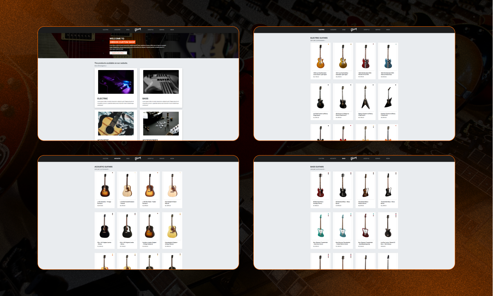

# Bu proje [Kodluyoruz](https://kodluyoruz.org) Front-End Patikası "Bootstrap" Dersinin 1. Odevidir

Bu ödevde CSS Dersinin ilk ödevinde yapmış olduğumuz "Müzik Dükkanı" projesini Bootstrap ile geliştirmemiz isteniyor.

Yapmamız istenilenler şu şekilde;

- Menüyü koyu renkli olarak düzenleyin. İsterseniz arka plan rengi de verebilirsiniz.

- Ana sayfaya bir jumbotron koyup içeriğinizin açıklamasını yazınız.

- Arka plan rengini #E9ECEF ile değiştirin.

- Ürünlerimiz sayfasında card yapısını kullanın.

- Kullandığınız card yapısını grid sistemin içinde kullanın.

- Ürün card boyutlarının tamamen aynı olduğuna dikkat edin.

- Hakkımızda (Ben **Gibson Anasayfası** olarak düzenledim) sayfasını da bir card yapısı içine alın.

