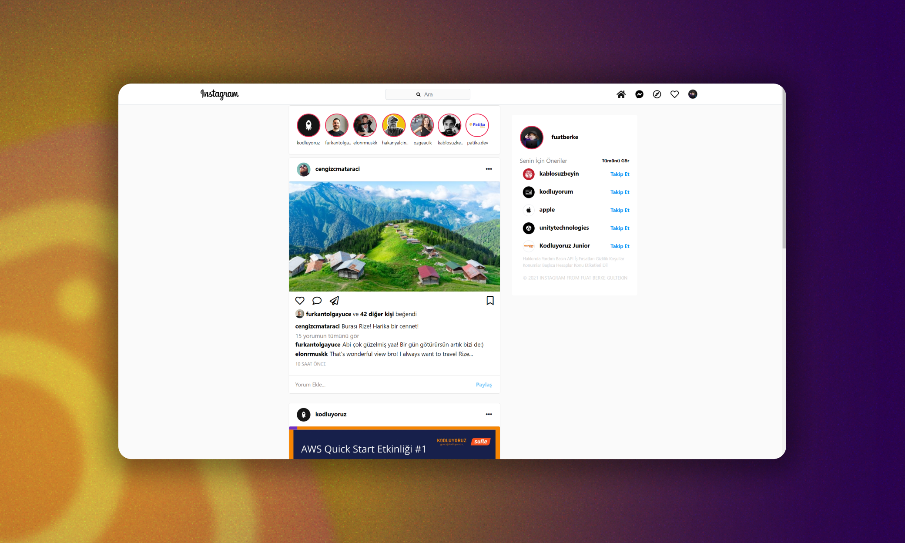
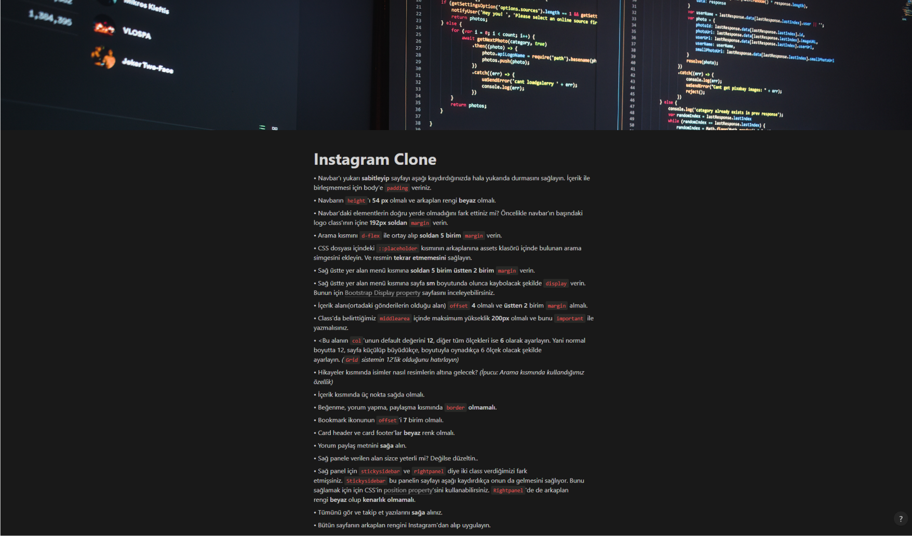

# Bu proje [Kodluyoruz](https://kodluyoruz.org) Front-End Patikası "Bootstrap" Dersinin 2. Odevidir

Bu ödevde bize bozulmuş şekilde verilen HTML ve CSS dosyalarını düzenleyip bu Instagram sayfasını oluşturmamız gerekiyor.

Projede istenilen değişikliklere aşağıdaki [görselden](image5.png) ulaşabilirsiniz 

