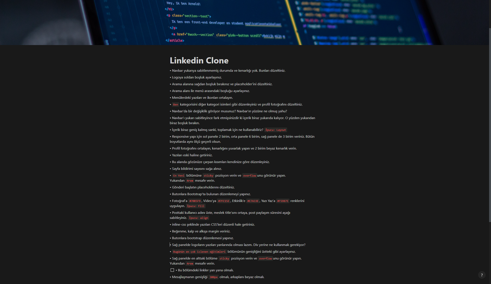

# Bu proje [Kodluyoruz](https://kodluyoruz.org) Front-End Patikası "Bootstrap" Dersinin 3. Odevidir

Bu ödevde bize verilmiş olan bozuk HTML ve CSS kodlarını inceleyip bu [sayfayı](https://github.com/Kodluyoruz/taskforce/blob/main/bootstrap/odev3/figures/garibanlinkedin.gif) gerçek [Linkedin](https://linkedin.com) sayfasına uygun olacak şekilde düzenlememiz isteniyor; 

Projede istenilen değişikliklere aşağıdaki [görselden](https://github.com/FuatBerke/kodluyoruz-odevler/blob/main/Bootstrap%20Odev3/linkedinclonelist.png) ulaşabilirsiniz

