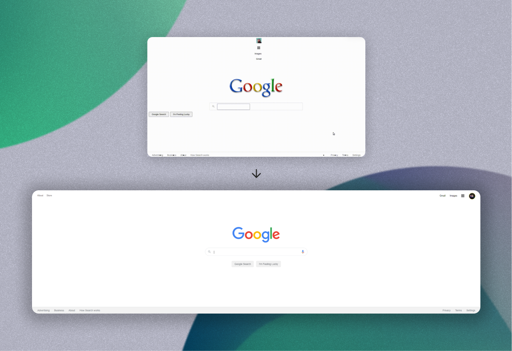

# Bu proje [Kodluyoruz](https://kodluyoruz.org) Front-End Patikası "CSS" Dersinin 3. ve Son Odevidir

 Bu ödevde bizden HTML ve CSS yapısı verilen Google sayfasını, [**orijinal halini**](https://web.archive.org/web/20191130234759/https://www.google.com/)  inceleyip detayları işlememiz isteniyor.

İstenilen değişiklikler şu şekilde;

* > Fark ettiyseniz logo eski bir Google logosu. Bu logoyu günümüzde logo ile değiştirmelisiniz.
* > Üstteki alanı sağ tarafa alın ve fotoğrafı kendi fotoğrafınız ile değiştirin ve fotoğrafın kenarlarını yarıçap özelliği ile düzenleyiniz.
* > Arama yapılacak alanın kenarlarını yarıçap özelliği ile düzenleyiniz.
* > Arama simgesi gibi sesle arama simgesini de siz ekleyin.
* > Arama alanında yazı yazılan yerin genişliği 480px olmalı ve kenarlığı olmamalı.
* > Buttonları ortaya alıp üstünden ve sağından boşluklar veriniz. Button kenarları 1px kalın #f2f2f2 renginde olmalı. Yazı tipi Arial, yazı rengi #5f6368, yazı boyutu 14px olmalı. Button yüksekliği 36px olmalı.
* > Buttonlara aynı arama alanında olduğu gibi gölge veriniz.
* > Footerda arkaplan rengini #f2f2f2 yapınız ve liste noktalarını ortadan kaldırın. 
* > Kod yazarken yorum satırları kullanmaya özen gösteriniz. 

