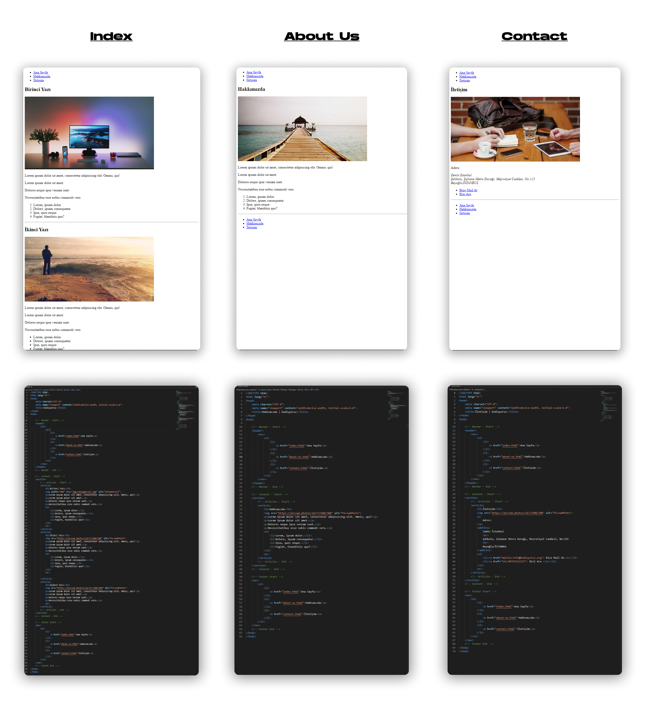

# Bu Proje [Kodluyoruz](https://kodluyoruz.org) Front-End Patikası   HTML Dersinin Bölüm Sonu Çalışmasıdır.

Yaptığımız projede HTML dersleri boyunca öğrendiklerimizi kullanarak;
- [**index.html**](https://github.com/FuatBerke/kodluyoruz-odevler/blob/main/HTML%20Bolum%20Sonu%20Calismasi/index.html)
- [**about-us.html**](https://github.com/FuatBerke/kodluyoruz-odevler/blob/main/HTML%20Bolum%20Sonu%20Calismasi/about-us.html)
- [**contact.html**](https://github.com/FuatBerke/kodluyoruz-odevler/blob/main/HTML%20Bolum%20Sonu%20Calismasi/contact.html)

olmak üzere, 3 sayfadan oluşan bir site yaptık ve bu sitedeki sayfalar arasındaki etkileşimleri ayarladık.

