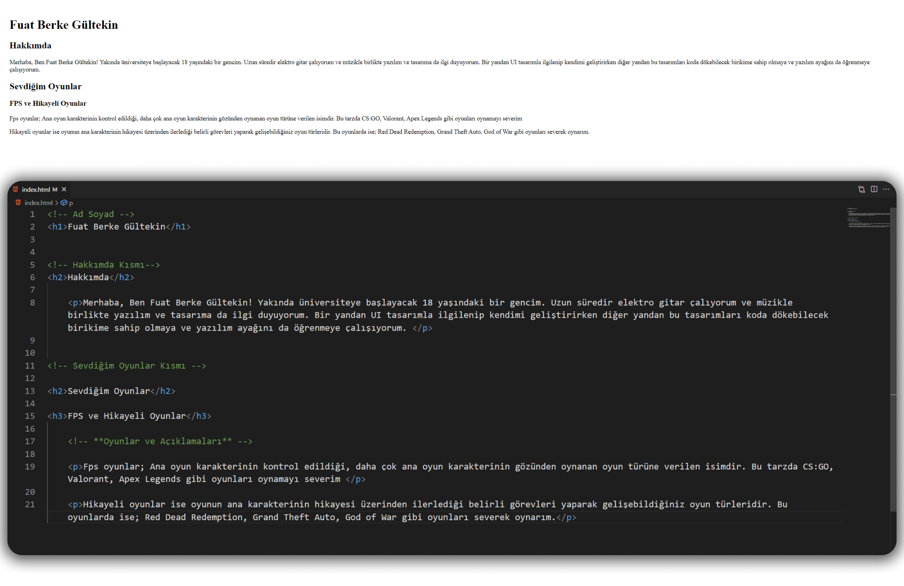

## HTML Odev 1

###### **Bu ödevde yapılması istenilenler şu şekilde;**
---
> Siteyi açtığımızda "Adınız ve Soyadınızı" `başlık` şeklinde göstermeniz gerekiyor.

> Ad-Soyadın altında `alt başlık` olarak "Hakkımda" yazmalıdır.

> Altına `paragraf` içerisinde "Neler yaptığınızı ve nelerden hoşlandığınızı" yazabilirsiniz.

> Web sitenizi kaydederken dosya adı olarak [**index.html**](https://github.com/FuatBerke/kodluyoruz-odevler/blob/main/HTML%20Odev1/htmlodev1.html) seçmeniz gerekmektedir.(**Bu repoya atarken `ödev ismi` olarak değiştirdim**)

> Yazdığınız kodları açıklayan `yorum satırları` eklemeyi unutmayın.

