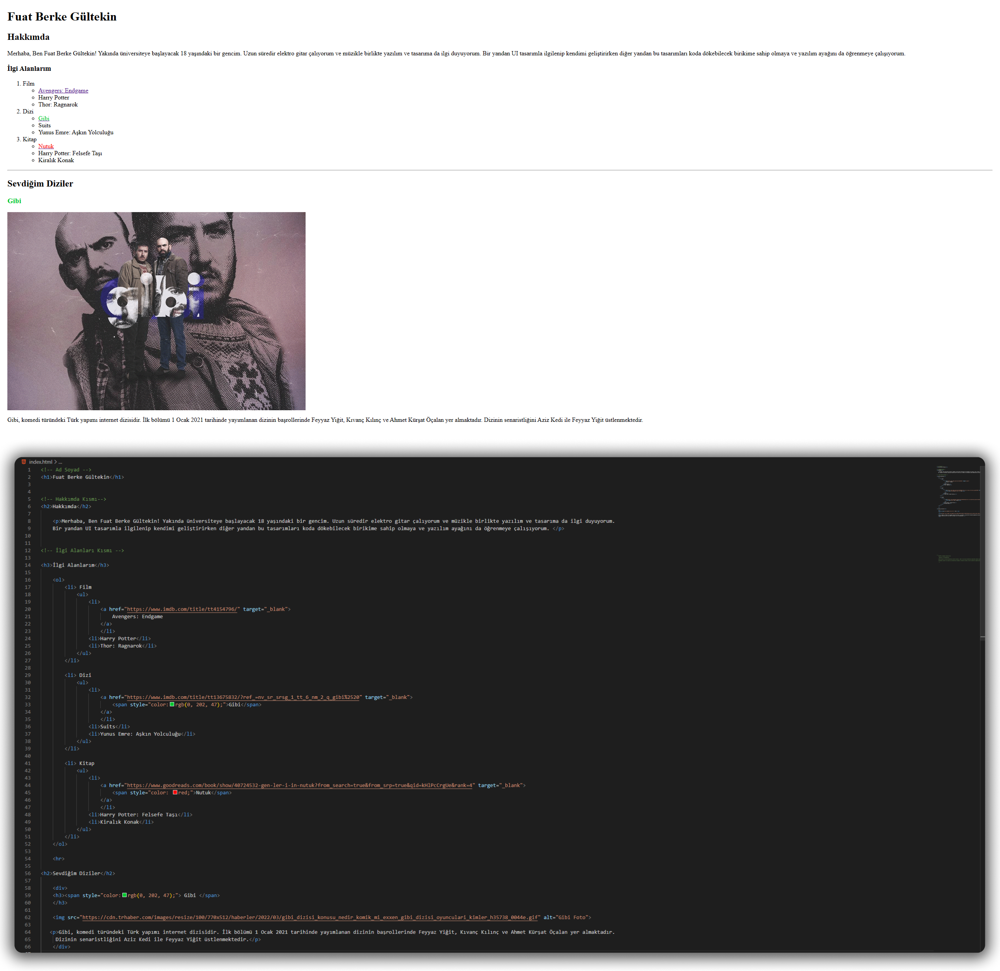

# HTML Odev 2

Bu ödevde yapılması istenilenler şu şekilde;

- Sayfanıza [(***index.html***)](https://github.com/FuatBerke/kodluyoruz-odevler/blob/main/HTML%20Odev2/htmlodev2.html) bir adet resim ekleyin ve bu resime bir açıklama yazın.

- Sevdiğiniz film, dizi ve kitapları bunlar başlıklar olacak şekilde sıralayınız. (Film, dizi, kitap sıralı liste, içerikleri `bullet list` olacak şekilde)

- Bunları sıralarken film ve dizilerin en az bir tanesine [**IMDb**](https://www.imdb.com/) linki, kitapların bir tanesine de  [**Goodreads**](https://www.goodreads.com/)  linkini yazınız.

- Kurduğunuz yapılarda `block, inline` gibi elementler kullanmaya çalışın.

