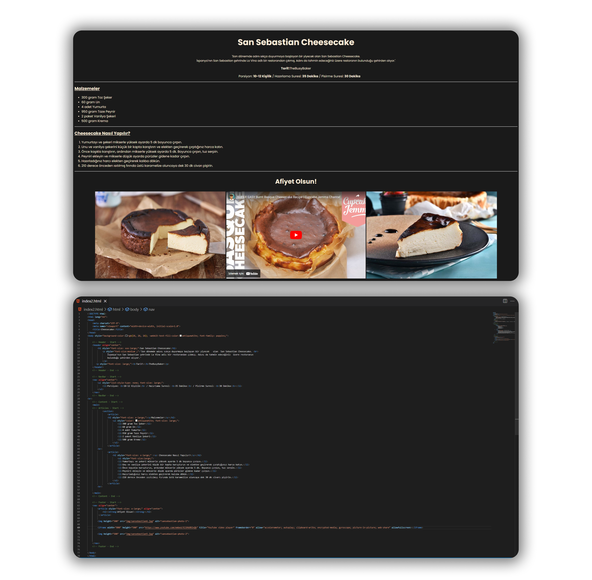

# Bu Proje [Kodluyoruz](https://kodluyoruz.org) Front-End Patikası HTML Dersinin 3. Odevidir

Bu ödevde sayfa [(***index.html***)](https://github.com/FuatBerke/kodluyoruz-odevler/blob/main/HTML%20Odev3/htmlodev3.png) içeriğinde;

* Tarif Başlığı
* Tarifle ilgili bilgi
* Porsiyon bilgisi ve Hazırlama-Pişirme Süreleri
* Malzemeler
* Tarifin nasıl yapıldığı

gibi bilgileri içeren bir tarif sayfası yapmamız isteniyor.

