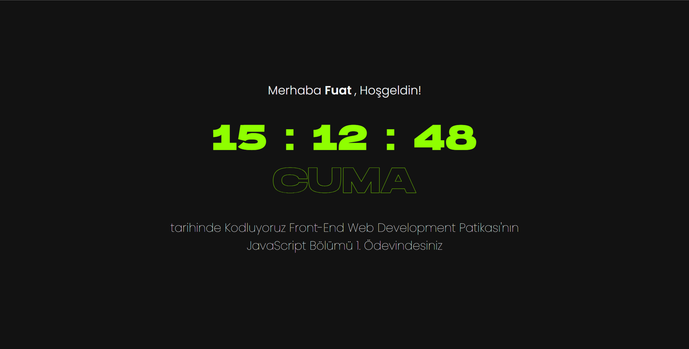

# Bu Proje [Kodluyoruz](https://kodluyoruz.org) Front-End Patikası JavaScript Dersinin 1. Odevidir

Bu projede JavaScript dersinde öğrendiklerimiz ile girişte isminizi isteyip sonra bu ismi karşılama ekranına yerleştirerek o anki saati ve günü gösteren bir ekran yapmamız  isteniyor. *Ödev örneğine [buradan](https://raw.githubusercontent.com/Kodluyoruz/taskforce/main/javascript/javascript-temel/odev1/figures/clock.gif) ulaşabilirsiniz*

