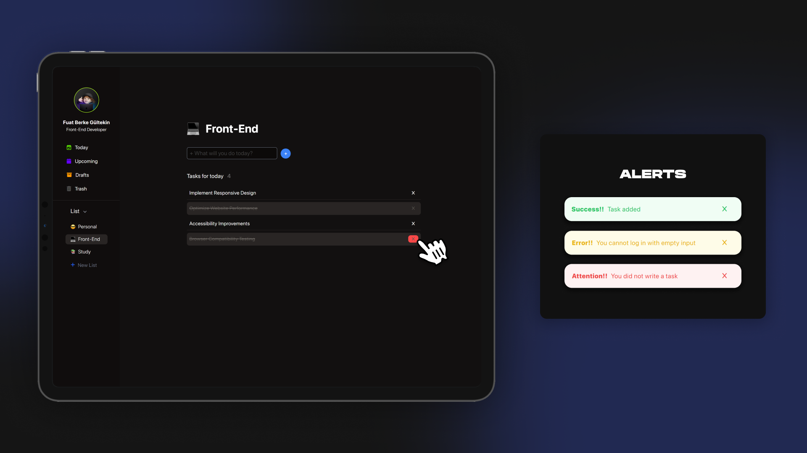

# Bu Proje [Kodluyoruz](https://kodluyoruz.org) Front-End Patikası JavaScript Dersinin 2. Odevidir

Bu projede JavaScript dersinde öğrendiklerimiz ile bir "To-Do List" yapmamız isteniyor.
Projede istenilen özellikler şu şekilde:

- Listeye boş karakter eklenemiyor. Bununla birlikte hiçbir şey yazılmadığında da aynı hatayı veriyor.
- Yazacağınız JavaScript kodu içerisinde element eklemeyi sağlayan bir fonksiyon, element silmeyi sağlayan bir fonksiyon, yapıldı işaretlenmesini sağlayan bir fonksiyon olması gerekiyor.
- Element eklendiğinde ve hata verirken sağ üstte uyarı verdiğini fark etmişsinizdir. Bunu sağlayan Bootstrap Toast bildirimdir. Sayfaya gidip toast nedir nasıl yapılır bunu araştırın ve kodunuza ekleyin. (Ben bu projede TailwindCss kullandım.)
- Yaptığınız yapıya Local Storage'ı da ekleyip verilerin kaybolmamasını sağlayın.

*"Projede [FontAwesome](https://fontawesome.com/) ve [TailwindCSS](https://tailwindcss.com/) kullanılmıştır projenin düzgün çalışması için indirdikten sonra bu iki yapıyı da kurmalısınız"*

