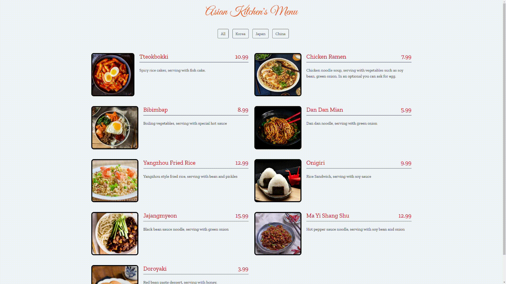

# Bu Proje [Kodluyoruz](https://kodluyoruz.org) Front-End Patikası JavaScript Dersinin 3. Odevidir

Bu projede JavaScript dersinde öğrendiklerimiz ile restoran menüsü şeklinde düzenlenmiş bir site yapmamız isteniyor.

Ödevde istenilenler şu şekilde:
- Sitedeki içerik JavaScript'te menu şeklinde bir dizi içinde objeler olarak tanımlanacak.
- Id, title, category, price, img ve desc bölümleri olacak.
- İçeriği istediğiniz gibi değiştirebilirsiniz yalnız değiştirirken kategori isimlerine ekstra dikkat edin.
- Butonlar da js dosyasından gelecek.

