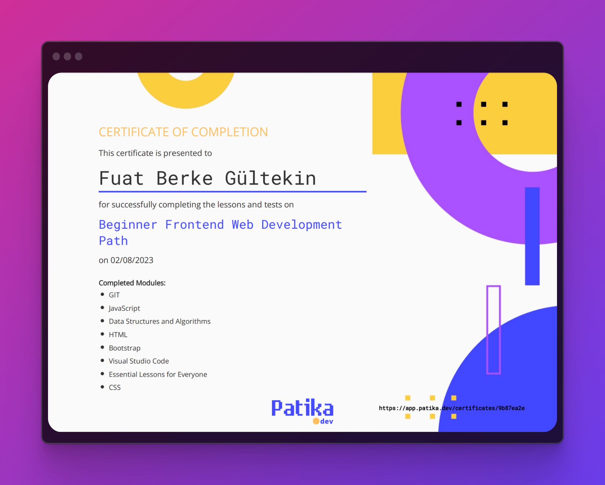

# Kodluyoruz "Beginner Front-End Web Development Path" Ödevleri

Bu repo [Kodluyoruz (Patika) **"Beginner"** Front-End Web Development eğitimi](https://academy.patika.dev/paths/baslangic-seviye-frontend-web-development-patikasi) kapsamında yaptığım ödevleri içermektedir.

- Ödevlerin **README** dosyalarında, ödevle ilgili **açıklamalar ve fotoğraflar** bulunmaktadır. 




## Installation
Öncelikle projeyi clonelayın.

```
https://github.com/FuatBerke/kodluyoruz-odevler.git
```

## Usage

Projeyi cloneladıktan sonra [Visual Studio Code](https://code.visualstudio.com/) programında açınız.

Linux için:

```
cd kodluyoruz-odevler
code .
```

## License

[MIT](https://choosealicense.com/licenses/mit/)
